# Wellness App 🏃‍♂️

A cross-platform application designed to support the monitoring and management of athletes' well-being, training load and recovery.

This project was developed as my **Final Degree Project (TFG) in Computer Engineering**. Its main goal is to provide athletes and sports professionals with a centralised platform where relevant physical, physiological and subjective data can be recorded, visualised and monitored over time.

> [!IMPORTANT]
> **Project status — Archived**
>
> This project is completed and is no longer under active development.  
> The Supabase backend used during development is currently inactive due to inactivity, so the application is **not available for live testing**.
>
> This repository is preserved as a showcase of the project's **source code, architecture, functionality and user interface**.

---

## 🔐 Authentication & Account Access

Wellness App includes different authentication flows depending on the type of user.

Athletes can create their own account by selecting their city and sports centre, while professional accounts are previously registered by an administrator and then activated by the corresponding user.

<p align="center">
  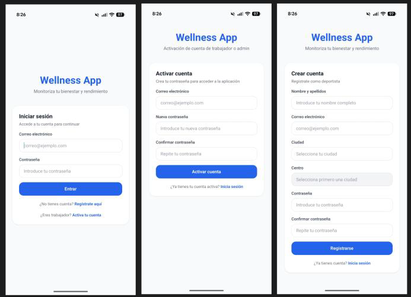
</p>

---

## 🎯 Project Overview

Wellness App was designed as a centralised platform connecting **athletes, coaches, medical staff and sports organisations**.

Athletes regularly record information related to their training, recovery and general well-being. This information can then be visualised through dashboards, summaries and charts and, depending on the user's role, reviewed by the professionals responsible for monitoring them.

The project is based on the idea that athletic performance should not be evaluated exclusively through training volume or intensity. Recovery, physiological indicators, physical discomfort and the athlete's own perception of their condition can also provide valuable information about their overall state.

The platform therefore combines multiple types of information within a single role-based application.

---

# 👥 User Roles

The application contains five differentiated user roles:

- 🏃 Athlete
- 🧑‍🏫 Coach
- 🩺 Medical Staff
- 🛠️ Administrator
- 🌐 Superadministrator

Each role has its own interface, permissions and available functionality.

---

## 🏃 Athlete

The athlete is the central user of Wellness App.

Athletes can record their daily information and consult their evolution through dedicated dashboards, charts and historical views.

### Main features

- Personal wellness dashboard
- Daily monitoring and data registration
- Training duration and perceived intensity
- Training load calculation and history
- Sleep duration and sleep quality tracking
- Heart rate monitoring
- Heart Rate Variability (HRV)
- Mood and motivation tracking
- Physical and mental fatigue
- Stress and irritability
- Perceived recovery
- Energy levels
- Readiness to train
- Physical discomfort and affected body areas
- Menstrual cycle and associated symptoms
- Historical data and graphical visualisation
- Automatic indicators and alerts
- Personal profile management

### Dashboard

The main dashboard provides a quick overview of the athlete's current state, including training load, sleep, HRV and mood.

It also combines recent data to generate an overall status and displays relevant alerts.

<p align="center">
  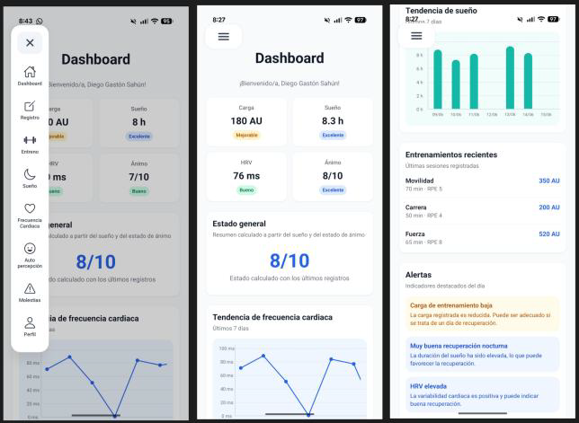
</p>

### Training Monitoring

Athletes can review their training history, analyse trends and inspect monthly statistics including training load, duration, intensity and training type.

<p align="center">
  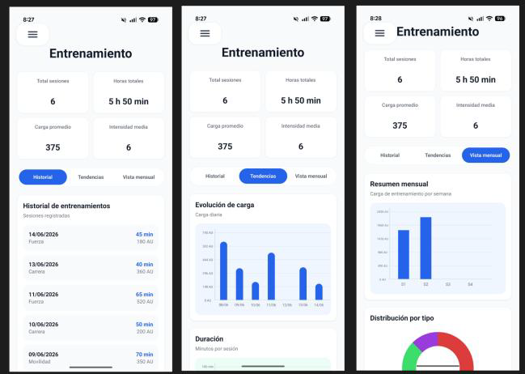
</p>

### Sleep & Heart Rate

Dedicated sections provide information about sleep duration and quality, together with heart rate and HRV evolution.

<p align="center">
  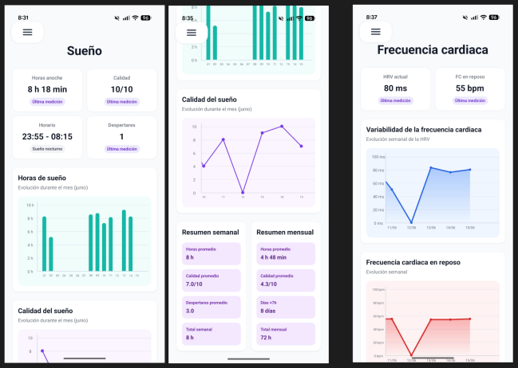
</p>

### Self-Perception

Subjective information is also monitored to complement physiological and training data.

Athletes can register variables such as mood, fatigue, energy and readiness to train and review their evolution over time.

<p align="center">
  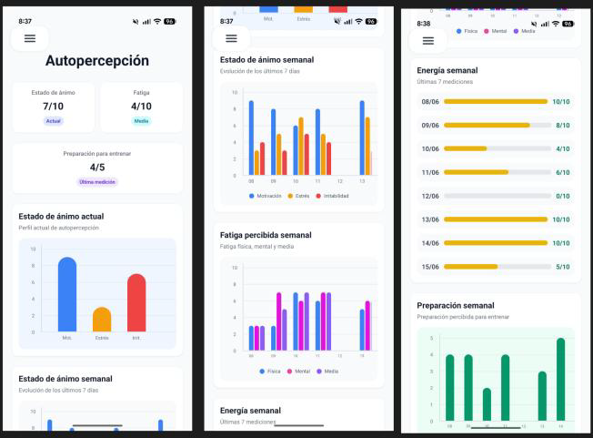
</p>

### Physical Discomfort & Menstrual Cycle

Athletes can record physical discomfort, its intensity and affected body areas.

The application also includes menstrual cycle monitoring with information about symptoms, pain and bleeding intensity.

<p align="center">
  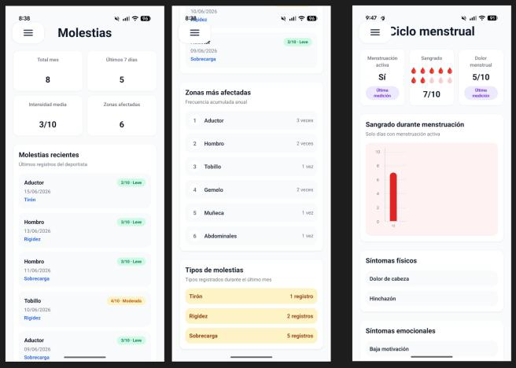
</p>

### Daily Register & Profile

The daily register centralises the information collected from the athlete, allowing the user to complete the different monitoring areas from a single workflow.

Athletes can also manage their personal profile and basic information.

<p align="center">
  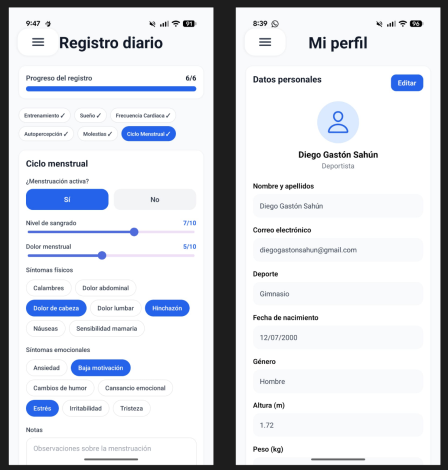
</p>

---

## 🧑‍🏫 Coach

Coaches can monitor athletes assigned to them while maintaining access restrictions according to their professional role.

Their interface focuses primarily on **training information, athlete evolution and relevant training-related alerts**.

### Main features

- Coach-specific dashboard
- View athletes from the same sports centre
- Assign and unassign athletes
- Access assigned athlete profiles
- Review training history
- Analyse training load
- Review training trends and monthly summaries
- Monitor physical discomfort relevant to training
- Access role-specific alerts
- Personal profile management

### Coach Dashboard

The coach dashboard provides a summary of assigned athletes and highlights relevant training or physical-discomfort information.

<p align="center">
  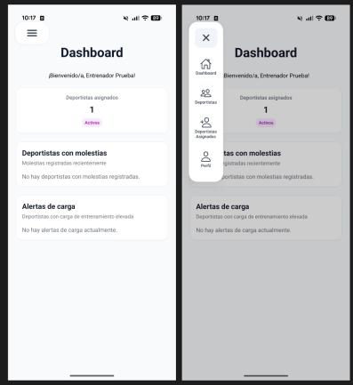
</p>

### Athlete Assignment

Coaches can view athletes belonging to their centre and manage which athletes are assigned to them.

<p align="center">
  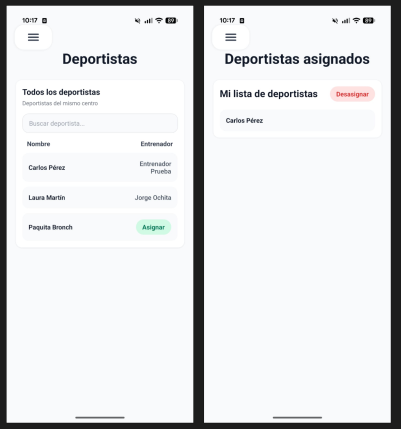
</p>

### Athlete Metrics

Once an athlete has been assigned, the coach can access relevant training information, including training history, load, duration, trends and monthly statistics.

<p align="center">
  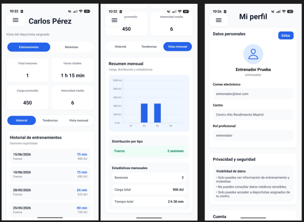
</p>

---

## 🩺 Medical Staff

Medical staff have a dedicated view focused on the physiological and physical-health information relevant to athlete monitoring.

The available information differs from the coach interface in order to maintain a clear separation between professional roles.

### Main features

- Medical staff dashboard
- View athletes from the same sports centre
- Assign and unassign athletes
- Access assigned athlete information
- Heart rate monitoring
- HRV monitoring
- Physical discomfort history
- Affected body areas
- Medical-oriented alerts
- Personal profile management

### Medical Dashboard

The dashboard provides direct access to assigned athletes and highlights relevant information such as recent physical discomfort, high HRV values or resting heart-rate alerts.

<p align="center">
  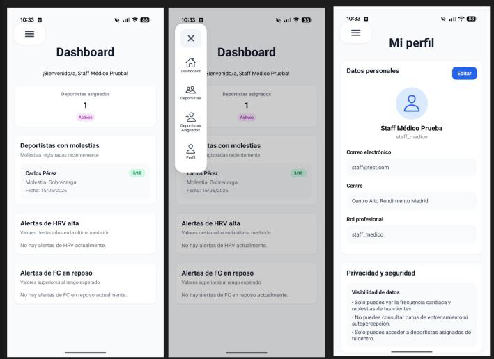
</p>

### Athlete Assignment

Medical professionals can manage the athletes assigned to them from the same sports centre.

<p align="center">
  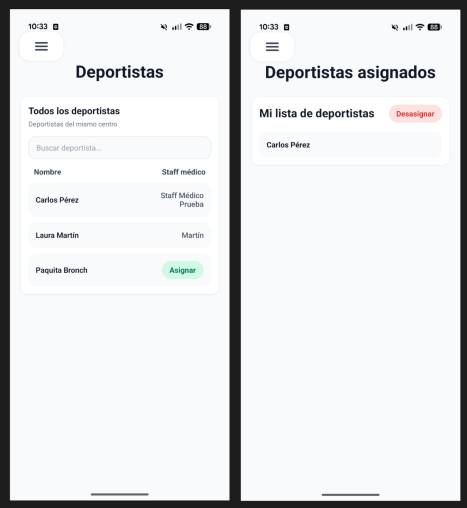
</p>

### Athlete Metrics

The medical view provides access to physiological information and physical discomfort records for each assigned athlete.

<p align="center">
  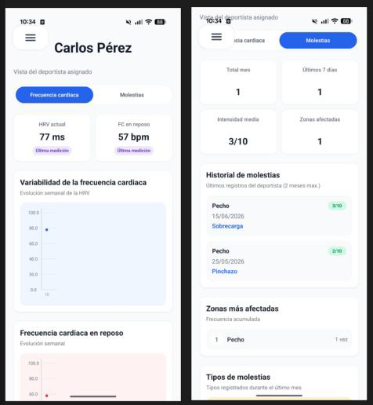
</p>

---

## 🛠️ Administration

Administrators manage users and professional accounts within their organisation.

Their interface provides the tools required to supervise registered users, manage account status and create professional accounts for coaches and medical staff.

### Main features

- Administration dashboard
- User management
- Filter users by role
- Block and unblock accounts
- Review pending requests
- Pre-register coaches
- Pre-register medical staff
- Manage worker account activation
- Administrator profile

### Administration Dashboard

The dashboard summarises users, workers, athletes, blocked accounts and pending requests.

<p align="center">
  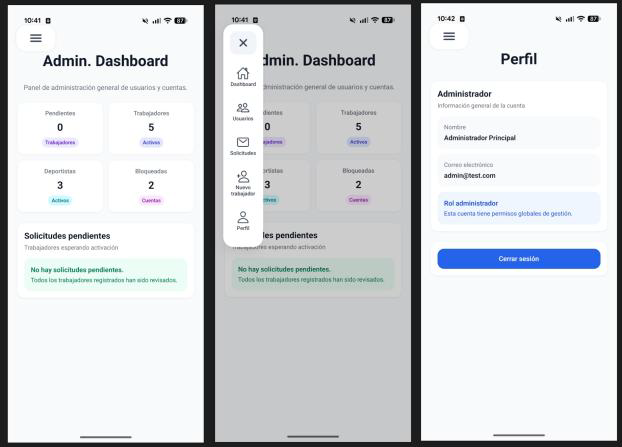
</p>

### User & Worker Management

Administrators can manage existing users, review requests and create new worker accounts.

<p align="center">
  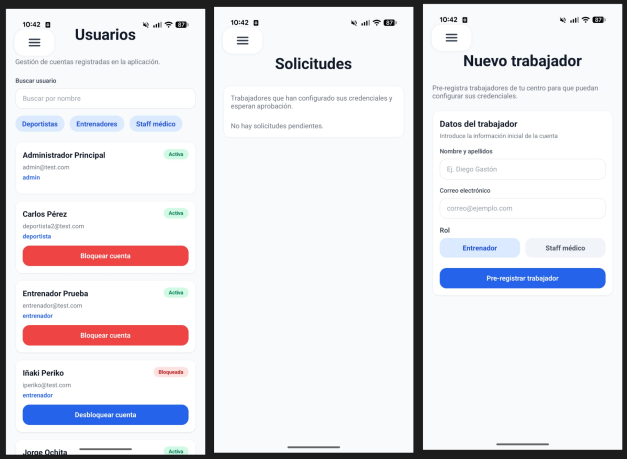
</p>

---

## 🌐 SuperAdministration

The superadministrator operates at the highest level of the platform and manages the organisational structure of the system.

This includes cities, sports centres and administrator accounts.

### Main features

- Global system dashboard
- City management
- Sports centre management
- Activate and deactivate centres
- Create administrator accounts
- Assign administrators to sports centres
- Block administrator accounts
- Global overview of the platform
- Superadministrator profile

### Global Dashboard

The superadministrator dashboard provides a global overview of the number of cities, sports centres and administrator accounts registered in the system.

<p align="center">
  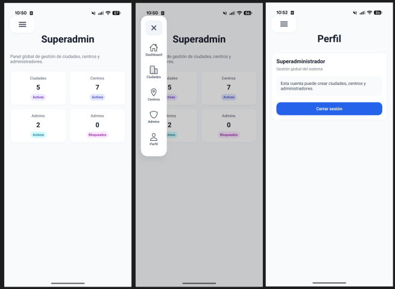
</p>

### Cities & Sports Centres

The organisational structure of the platform can be managed directly from the superadministrator interface.

Cities and sports centres can be created, searched, activated or deactivated.

<p align="center">
  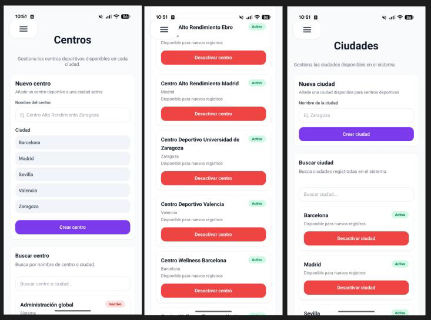
</p>

### Administrator Management

Superadministrators can create administrators, associate them with a city and sports centre and manage existing administrator accounts.

<p align="center">
  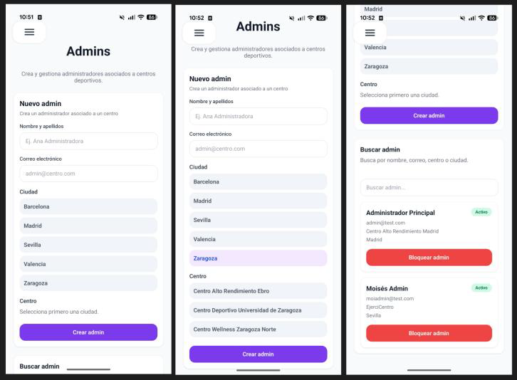
</p>

---

## 📊 Data Monitored

Wellness App brings together several dimensions related to athletic performance and recovery:

| Area | Examples |
|---|---|
| 🏋️ Training | Duration, intensity, load, training type |
| 😴 Sleep | Sleep duration, sleep quality, awakenings |
| ❤️ Cardiovascular | Heart rate, resting heart rate, HRV |
| 🧠 Self-perception | Mood, motivation, stress, irritability |
| ⚡ Recovery | Energy, fatigue, perceived recovery, readiness to train |
| 🩹 Physical condition | Discomfort, intensity, affected body areas |
| 🩸 Menstrual health | Menstruation status, pain, bleeding and associated symptoms |

These indicators can be analysed individually or combined through dashboards and historical visualisations.

---

## 🧑‍💻 Tech Stack

### Frontend

- **React Native**
- **Expo**
- **TypeScript**
- **Expo Router**
- **NativeWind / Tailwind CSS**

### Backend & Data

- **Supabase**
- **Supabase Authentication**
- **PostgreSQL**
- **AsyncStorage**

### Data Visualisation

- **React Native Gifted Charts**
- **React Native Chart Kit**
- **React Native SVG**

### Platforms

The project was developed as a cross-platform application targeting:

- 📱 Android
- 🍎 iOS
- 🌐 Web

---

## 🏗️ Project Architecture

The application follows a role-based architecture, separating the main interfaces and functionality according to each type of user.

```text
app/
├── athlete/
├── coach/
├── medical-staff/
├── admin/
├── superadmin/
└── auth/
```

Reusable components, authentication logic, Supabase configuration and shared utilities are separated from the route-specific views.

This structure helps maintain clear boundaries between the different roles and their permissions.

---

## 🎓 Academic Context

Wellness App was developed as my **Final Degree Project in Computer Engineering**.

The project involved the design and implementation of a complete application ecosystem, including:

- Requirements analysis
- User-interface design
- Mobile application development
- Authentication
- Role-based access control
- Relational data modelling
- Cloud database integration
- Data visualisation
- User and organisational management
- Cross-platform development

The objective was not only to build a functional application, but also to explore how software can centralise information from the different areas involved in **athlete health, recovery and performance monitoring**.

---

## 📌 Repository Status

This repository is maintained for **portfolio and documentation purposes**.

The application was fully developed and used with a Supabase backend during the development of the project. That backend is currently inactive due to inactivity, meaning that the authentication and database-dependent functionality cannot currently be tested.

The source code and project structure remain available to demonstrate the implementation and design of the application.

---

## 👤 Author

**Diego Gastón Sahún**

Computer Engineering & Video Game Design and Development graduate.

GitHub: [@Dirogi](https://github.com/Dirogi)

---

*Academic project developed as part of my university studies.*
